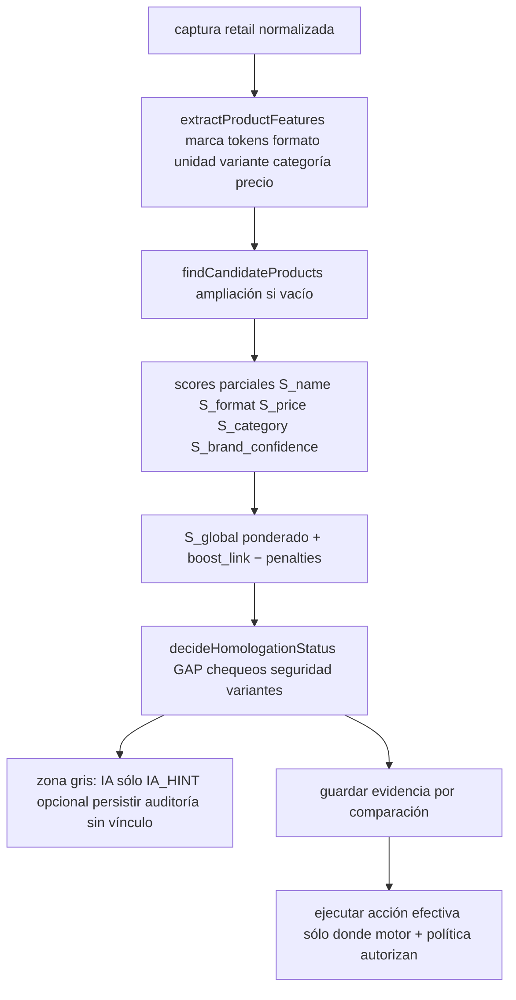

# Plan de homologación determinística — **estándar Captura cadenas 2**

**Clarificación de producto (acordada):**

| Rol | Rutas / piezas |
|-----|----------------|
| **Legado (antiguo)** — será **reemplazado y retirado** más adelante | [`precios-cadenas/page.tsx`](src/app/(app)/precios-cadenas/page.tsx) (monta [`RetailPricingTab`](src/app/(app)/catalog/RetailPricingTab.tsx), acciones [`catalog-retail.ts`](src/app/actions/catalog-retail.ts), motor [`retail-homologation-engine.ts`](src/server/retail/homologation/retail-homologation-engine.ts), snapshots `catalog_retail_*`). |
| **Estándar (nuevo)** — **permanece** como línea de scrapping + homologación | [`captura-cadenas-2/page.tsx`](src/app/(app)/captura-cadenas-2/page.tsx), [`CapturaCadenas2Client.tsx`](src/app/(app)/captura-cadenas-2/CapturaCadenas2Client.tsx), [`scrapping-similarity-bulk-progress.tsx`](src/app/(app)/captura-cadenas-2/scrapping-similarity-bulk-progress.tsx), [`scrapping-similarity-review-modal.tsx`](src/app/(app)/captura-cadenas-2/scrapping-similarity-review-modal.tsx). Servidor: [`scrapping-similarity-*`](src/server/retail/scrapping/), tabla `scrapping`, [`retail-scrapping.ts`](src/app/actions/retail-scrapping.ts), [`lider-scrapping-service`](src/server/retail/scrapping/lider-scrapping-service.ts), etc. |

**Ámbito de implementación de este documento:** evolucionar **motor y reglas** determinísticas donde impacta el **estándar** (paso 2 similitud, bulk, candidatos, decisiones). El legado **Precios cadenas** puede convivir sin el nuevo motor hasta la **fase de retiro** que pidas aparte.

**Líneas rojas:** no dañar **maestros**; no romper **Captura cadenas 2** al retirar legado.

Corrige y reemplaza versiones anteriores mezcladas. **No implementado aún** hasta aprobación explícita (“ejecutá el plan”).

---

## Visión de reemplazo (sin ejecutar aún)

| Fase | Qué pasa |
|------|----------|
| **A · Ahora** | El **estándar** ([`/captura-cadenas-2`](src/app/(app)/captura-cadenas-2/)) absorbe el diseño correcto (motor de score, auditoría, IA solo hint). |
| **B · Cuando el estándar esté estable** | Operación diaria y decisiones de equipo se apoyan en Captura cadenas 2 + `scrapping` + pasos homologación definidos ahí. |
| **C · Retiro del legado** | Bajo tu pedido: bajar [`/precios-cadenas`](src/app/(app)/precios-cadenas/page.tsx) y la UX asociada (`RetailPricingTab` en ese contexto, partes de [`catalog-retail.ts`](src/app/actions/catalog-retail.ts) que sólo sirvan a ese flujo) **sin** tocar maestros **ni** romper Captura cadenas 2. |

---

## Alcance producto (resumen)

| Estándar (construir/evolucionar aquí) | Legado (convive hasta retiro) |
|----------------------------------------|------------------------------|
| `/captura-cadenas-2` + archivos que listaste arriba | `/precios-cadenas` ([`page.tsx`](src/app/(app)/precios-cadenas/page.tsx)) |
| [`scrapping-similarity-bulk-prep.ts`](src/server/retail/scrapping/scrapping-similarity-bulk-prep.ts), [`scrapping-similarity-manual.ts`](src/server/retail/scrapping/scrapping-similarity-manual.ts), [`scrapping-similarity-ia-resolve.ts`](src/server/retail/scrapping/scrapping-similarity-ia-resolve.ts) | [`retail-homologation-engine.ts`](src/server/retail/homologation/retail-homologation-engine.ts), [`retail-ai-resolver.ts`](src/server/retail/homologation/retail-ai-resolver.ts) donde alimentan solo Precios cadenas |
| [`retail-scrapping.ts`](src/app/actions/retail-scrapping.ts) | Homolog picker masivo sólo desde `RetailPricingTab` legacy |
| Tabla `scrapping`, vínculos al cerrar desde modal/bulk estándar | Snapshots/col batch antiguos usados sólo por el legado |

Los principios determinísticos, IA solo hint y evidencia auditoría aplican al **estándar Captura cadenas 2**.

---

## Principios (regla central)

| Querés | Evitás |
|--------|--------|
| Algoritmo **determinístico**, **auditable**, **seguro** | IA como decisor primario |
| Precio como **feature** en score, no barrera ciega temprana | Nuevo producto solo por “búsqueda débil” sin segunda pasada ni anti‑duplicado |
| IA solo **ayuda** (`ai_hint`, `ai_score`, `candidate_suggested`, `reason`) | IA que **auto‑vincule**, borre filas o cree maestro |
| **Explicabilidad**: cada decisión con motivos y scores guardados | Sistema que “adivina” |

---

## Flujo objetivo de alto nivel (1–9)



---

## Estado actual del código

### Estándar — Captura cadenas 2 (donde debe vivir el rediseño)

| Qué buscás | Dónde mirar |
|------------|-------------|
| UI pasos homologación, modal paso 2 | [`CapturaCadenas2Client.tsx`](src/app/(app)/captura-cadenas-2/CapturaCadenas2Client.tsx), [`page.tsx`](src/app/(app)/captura-cadenas-2/page.tsx) |
| Barra bulk / revisión manual | [`scrapping-similarity-bulk-progress.tsx`](src/app/(app)/captura-cadenas-2/scrapping-similarity-bulk-progress.tsx), [`scrapping-similarity-review-modal.tsx`](src/app/(app)/captura-cadenas-2/scrapping-similarity-review-modal.tsx) |
| Bulk + decisión por fila | [`scrapping-similarity-bulk-prep.ts`](src/server/retail/scrapping/scrapping-similarity-bulk-prep.ts), [`decideRetailMaster`](src/lib/retail-association.ts), [`scrapping-similarity-manual.ts`](src/server/retail/scrapping/scrapping-similarity-manual.ts) (RPC, **filtro banda precio**) |
| IA que puede autovincular | [`scrapping-similarity-ia-resolve.ts`](src/server/retail/scrapping/scrapping-similarity-ia-resolve.ts) |
| Actions | [`retail-scrapping.ts`](src/app/actions/retail-scrapping.ts) |

**Brechas vs modelo deseado (estándar):** banda CLP como filtro temprano; compuesto viejo [`retail-association`](src/lib/retail-association.ts); **IA ejecuta vínculo**; falta auditoría granular y motor `S_*` / penalizaciones explícitos.

### Legado — Precios cadenas ([`page.tsx`](src/app/(app)/precios-cadenas/page.tsx))

| Qué buscás | Dónde mirar |
|------------|-------------|
| Página entrada | [`precios-cadenas/page.tsx`](src/app/(app)/precios-cadenas/page.tsx) → [`RetailPricingTab`](src/app/(app)/catalog/RetailPricingTab.tsx) |
| Motor homologación batch capturas | [`retail-homologation-engine.ts`](src/server/retail/homologation/retail-homologation-engine.ts), [`retail-score.ts`](src/server/retail/homologation/retail-score.ts), IA [`retail-ai-resolver.ts`](src/server/retail/homologation/retail-ai-resolver.ts) |

**Este legado será retirado** en fase posterior; cualquier mejor fuerte debe **priorizar código compartido** consumido por el estándar, o vivir sólo hasta el corté del legado.

---

## Especificación contractual (tu corrección punto por punto)

### 1. Precio: no puerta cerrada inicial

**Hoy:**

- En el **estándar** Captura cadenas 2, la selección de candidatos (p. ej. [`scrapping-similarity-manual.ts`](src/server/retail/scrapping/scrapping-similarity-manual.ts) / bulk prep) suele aplicar **banda de precio CLP u homólogos** antes de ordenar/decidir → efecto puerta inicial.
- En el **legado** Precios cadenas, [`retail-homologation-engine.ts`](src/server/retail/homologation/retail-homologation-engine.ts) invoca `catalog_retail_match_candidates` con **`p_price`**; el RPC también puede sesgar candidatos por precio.

**Meta (estándar Captura cadenas 2):**

- Dos capas RPC o **segunda pasada amplia** sin precio/tolerancia dura al inicio; ver punto 11.
- Opción mínima sin tocar Postgres: segunda invocación con `p_price: null` o banda muy ancha cuando la primera no devuelve candidatos útiles.

**Nota:** el filtro duro por precio en la tubería `scrapping` **es** el problema a corregir en el **estándar**; el motor nuevo y `S_price` deben vivir donde impacta [`scrapping-similarity-*`](src/server/retail/scrapping/). El legado [`retail-homologation-engine.ts`](src/server/retail/homologation/retail-homologation-engine.ts) se retira en fase posterior **sin** arrastrar esa lógica como verdad de producto.

### 2–3. Normalización extendida (`normalizeProductText`)

Debe producir texto comparable para tokens y formato:

- Acentos, mayúsculas, espacios, puntuación.
- Eq. volumen explícitos: „1 L ↔ 1000 ml“ después de **`extractProductFeatures`** (normalizar ml canónico antes de **`calculateFormatScore`**).
- Equiv. masa: kg / g / gr.
- Detectar pack: „x6“, „6 un“, „pack“, „sixpack“.
- Lista **stop‑promotional:** oferta, nuevo, ahorro, familiar, promo, etc. (solo para matching de texto, puede quedar campo `removed_noise_tokens[]` para auditoría).

**Base existente:** `normalizeSearchText` + `normalizeRetailCapturedInput`; **hay que estirar**, no suficiente para todo lo pedido.

### 4. Marca compatible con alias

**Evitar inclusión naive como único criterio.** Usar marca normalizada + tabla o helper de aliases (nombre + variantes graficas Coca/Coca-Cola/Nestlé).  
**Contrato:** nivel de fuerza (“strong” vs “weak” match) para autolink sólo si **compatibilidad fuerte**; **`marca alias débil: −0.15`** antes de decisión AUTO_LINK.

(Submarcas incorrectas tratadas también con penalizaciones tipo / tokens distintivos.)

### 5. Tokens importantes ponderados (`calculateNameScore`)

No Jaccard plano sobre todos los tokens.

- Clasificar tokens: `{base_type, variant, flavor, format, promo_noise, generic}` desde un pequeño lexicón proyectual + patrones (‚zero‚, light, sin azúcar, sabores conocidos…).
- `S_name` = función acotada 0–1 agregación ponderada (ej. errores grandes si tokens base distantes).

---

### 6. Score global (estructura fija que pedís)

Todos los componentes **persistibles** como snapshot JSON antes de cualquier efecto lateral.

$$
S*{global}=\mathrm{clamp}\bigl(0.38·S*{name}+0.22·S*{format}+0.18·S*{price}+0.12·S*{category}+0.10·S*{brandConfidence}+Boost*{link}-\sum penalties\bigr)\in[0,1]
$$

**Notas implementación:**

- `Boost_link` igual espíritu que hoy pero acotado.
- Clamp post‑suma penalizaciones; documentar orden de aplicación (**penalties después del mix base** antes de decisión recomendado).

---

### 7. `S_price` (porcentajes y CLP combinados como pedís)

Ejemplo tabla operacional (implementar función pura **`calculatePriceScore`**):

| Regla aplicada (si se cumplen varias usar la mejor puntuación) | Valor |
|-----------------------------------------------------------------|-------|
| \|Δ|\le 500 CLP | **1.00** |
| **o** \(\frac{|Δ|}{\max(P_r,P_m)}\le 5\%\) | **0.85** |
| \|Δ|\le 1500 CLP | **0.75** |
| **o** \(\le\) 10% | **0.65** |
| \(\le\) 25% relativo | **0.45** |
| \(\le\) 50% | **0.15** |
| \>50% sin cruce con reglas más favorables | **0.00** |

**Barrera seguridad AUTOLINK explícita** además **`S_price ≥ 0.45`** (tu punto 9).

### 8. Penalizaciones obligatorias (antes de clasificar estado)

Lista que diste (**aplicación sumativa acotada o cap mínimo 0 después de clamp** definir en código; documentar mismo valor que negociaste):

| Heurística detrás del flag | Δ |
|-----------------------------|-----|
| zero vs normal | −0.30 |
| light vs normal | −0.25 |
| sin azúcar vs normal | −0.30 |
| sabor distinto | −0.25 |
| pack vs unidad | −0.45 |
| tipo base distinto | −0.50 |
| formato muy distinto | −0.35 |
| marca alias débil | −0.15 |
| categoría incompatible | −0.30 |

**Ejemplo Coca Zero vs Coca Original:** aun si formato/precio copados, debe caer penalización suficiente + falta seguridad marca variante ⇒ **AUTOLINK imposible** y **REVISIÓN** obligatoria si sube algo el score textual.

Implementación: función pura **`applyPenalties(detectorSignals): number`** retornando **sumatoria penalizaciones efectivas**.

### 9. `calculateFormatScore` (`S_format` discreto inicial)

Tu tabla sugerida (función **`calculateFormatScore`**):

| Situación | `S_format` |
|-----------|-------------|
| Formato equivalente exacto (**incluye 1L vs 1000ml**) | **1.00** |
| Diff volumen \(\le\) 10% | **0.80** |
| Diff \(\le\) 20% | **0.55** |
| Diff fuerte pero “comparable” (definición = entre 20–35% mismo tipo unidad ej.) | **0.35** |
| pack vs unit | **0.00** |
| no detectado | **0.50** |

**Seguridad AUTO_LINK obliga además:** `S_format ≥ 0.75`.

### `GAP`

Tras ordenar todos los candidatos restantes viables:

`GAP = best - second_best`

AUTO_LINK sólo si además (**todas verdaderas**):

- `S_global ≥ 0.94`
- `S_name ≥ 0.55`
- `S_format ≥ 0.75`
- `S_price ≥ 0.45`
- `GAP ≥ 0.08`
- marca compatible fuerte (`S_brandConfidence` suficiente + penalizaciones cero efectivos de variante?)
- conflictos declarados en flags: `{variant_conflict, flavor_conflict, base_type_conflict, pack_unit_conflict}=false`

**Si score alto pero GAP insuficiente:** **jamás** AUTOLINK.

### 10. Estados finales (motor)

Debe ser enum único proyecto:

| Estado | Condición ejemplo (motor) |
|--------|---------------------------|
| **AUTO_LINK** | Reglas seguridad punto 9 + sin contradicciones |
| **MANUAL_REVIEW_FAST** | Ej. \(0.90\le S*{global}<0.94\) o duda menor menor |
| **IA_HINT_REVIEW** | \(0.70\le S*{global}<0.90\) (IA opcional después de guardar evidencia) |
| **MANUAL_REVIEW** | \(0.50\le S*{global}<0.70\) o ambiguo (gap bajo peso alto, etc.) |
| **PENDING_NEW** | `S_global < 0.50` **salvo** riesgo duplicado ⇒ forzar revisión |
| **REJECTED_CANDIDATE** | Contradicción fuerte (ej. formato/pack/unit impossible) ⇒ descartado del ranking efectivo antes de nueva pasada amplia |

Mapear luego estos estados a **status columnas BD existentes** sin migración nueva si es posible; si hace falta columna nueva o tabla auditar ⇒ **aprobar antes**.

### 11. Segunda pasada amplia antes de NEW

Si después de primera búsqueda **no hay candidatos** ⇒ **segunda llamada**:

- marca compatible (+ alias fuerte/medio?)
- subset tokens base + categoría cercana ± tolerancia texto

Si **persiste vacío ⇒ PENDING_NEW** (no porque falló primera sola vez).

---

### 12. Contrato IA (estricto)

**Entrada (sólo bandas donde se permite invocación):**

- producto scraped normalizado/features
- top 3 candidatos + todas las features/scores ya calculadas
- `reason_doubt_codes[]`

**Salida permitida sólo:**

```json
{
  "ai_score": 0-1 opcional float,
  "ai_hint": "string UX",
  "candidate_suggested": "uuid opcional solo sugerencia",
  "reason": "string modelo"
}
```

**Prohibido:** upsert vínculos, delete scrapping snapshots, crear `catalog_products` desde modelo.

Ejecución sólo zonas donde score ya **no cerró decisión alta/baja deterministicamente** (**no masivo** si backlog masivo decidió ya).

Persistir dentro de objeto auditoría mismo registro revisión (**no ejecutar side effects sólo porque IA recomendó something**).

### 13. Auditoría persistente (**requiere acuerdo de esquema**)

Lista de campos que pedís (por comparación scraped vs candidate efectivo auditado incluso antes de efecto lado servidor):

```
capture_row_id       (id fila `scrapping` / snapshot homologación — **Captura cadenas 2**)
candidate_product_id UUID nullable
S_name,S_format,S_price,S_category,S_brand_confidence
boost_link penalties[] S_global GAP decision reason
ai_score ai_hint created_at (+ job_id batch corrida opcional)
```

**Migración nueva / JSONB nueva / tabla `retail_homolog_decision_audit`:** ⚠ necesita tu **aprobación previa**. Alternativa MVP: log estruct JSON en campo existente sólo si ya hay columna disponible (**verificar SCHEMA** antes de implementar).

### 14. Arquitectura código sugerida (funciones separadas · test unit simples)

Todos en módulos puros donde sea posible bajo `@/server/retail/homologation/engine-vnext/` (**nuevo archivo por función** ejemplo):

```
normalizeProductText
extractProductFeatures
findCandidateProducts        // wrappers RPC + segunda pasada
calculateNameScore
calculateFormatScore         // nueva grilla vs retailFormatsCompatible bool
calculatePriceScore
calculateCategoryScore
calculateBrandConfidence
applyPenalties               // tabla que diste sumatoria penalizaciones efectivas caps
calculateGlobalScore
decideHomologationStatus    // clasifier estados usando reglas seguridad IA_NO_AUTOLINK
```

**Adaptadores delgados** deben llamar estos desde la **tubería estándar**:

- [`scrapping-similarity-bulk-prep.ts`](src/server/retail/scrapping/scrapping-similarity-bulk-prep.ts), [`scrapping-similarity-manual.ts`](src/server/retail/scrapping/scrapping-similarity-manual.ts) y puntos donde hoy usa [`decideRetailMaster`](src/lib/retail-association.ts) / scores viejos.
- Opcionalmente compartir módulos puros con el legado **solo** si reduce duplicación temporal; la **prioridad de producto** es el estándar.

**Legado [`retail-homologation-engine.ts`](src/server/retail/homologation/retail-homologation-engine.ts):** no es el objetivo de la primera entrega; puede quedar sin el motor vnext hasta su retiro (`/precios-cadenas`).

**Deuda controlada:**

- Extracción progresiva: primero refactor **sin** nueva tabla ⇒ unit tests funcion puras ⇒ conectar después persistencia cuando apruebas migración IA hint storage.

---

### 15. Resultado esperado operacional

Cuando se homologan filas **scrapping** en **Captura cadenas 2** (modal paso 2, bulk):

Claramente igual + reglas seguridad ⇒ **AUTO_LINK sólo después de auditoría in‑memory antes de efecto efectivo.**

Parecidos ⇒ **REVISIÓN** (speed lane vs full según clasificación).

Probable nuevo ⇒ **PENDING_NEW** tras segunda pasada y sin señales duplicado.

IA aparece ⇒ **solo metadata sugerencias** dentro zócalo zona gris, **usuario o motor siguiente iteración siguen necesidad confirmación efectiva.**

---

## Fases cambio mínimo seguro (**propuesto implementación después de OK**)

### Fase 0 — Inventario rápido (sin romper UX)

Confirmar writes y estados en la tubería **Captura cadenas 2** (tabla `scrapping`, vínculos al cerrar, bulk) y pruebas manuales mínimas en **`/captura-cadenas-2`**.

### Fase 1 — Cortar IA como decisor (**estándar primero**)

**Prioridad seguridad alta:**

- Ajustar [`scrapping-similarity-ia-resolve.ts`](src/server/retail/scrapping/scrapping-similarity-ia-resolve.ts) para que la salida sea **solo** `ai_hint` / `ai_score` / `candidate_suggested` / `reason`, **sin** autovínculo ni escrituras por decisión del modelo.

- En paralelo **opcional** (legado): mismo criterio en [`retail-ai-resolver.ts`](src/server/retail/homologation/retail-ai-resolver.ts) + [`retail-homologation-engine.ts`](src/server/retail/homologation/retail-homologation-engine.ts) hasta que exista **Fase 5** de retiro de `/precios-cadenas`.

### Fase 2 — Motor scoring puro paralelo (**feature flag ENV** opcional hasta calibración)

Ejecutar motor nuevo lado servidor **solo logging / shadow mode** antes de efectos reales (comparacion salida OLD vs NEW).

### Fase 3 — Comportamiento real + RPC precio refactor

Migración SQL sólo después de texto aprobación tuya (**no RLS improvisado** sin diagnóstico).

### Fase 4 — Persistencia evidencia oficial

Migración tabla/JSON cuando apruebas.

### Fase 5 — Retiro del **legado Precios cadenas** (bajo tu pedido explícito, **otro** plan de trabajo)

Dar de baja [`/precios-cadenas`](src/app/(app)/precios-cadenas/page.tsx), entrada de menú asociada, y código que **solo** sirva a ese flujo ([`RetailPricingTab`](src/app/(app)/catalog/RetailPricingTab.tsx) en ese contexto, partes de [`catalog-retail.ts`](src/app/actions/catalog-retail.ts), [`retail-homologation-engine.ts`](src/server/retail/homologation/retail-homologation-engine.ts)) **sin**:

- migraciones destructivas sobre **maestros** (`catalog_products` y datos de catálogo operativos),
- romper **`/captura-cadenas-2`**, tabla `scrapping`, ni [`retail-scrapping.ts`](src/app/actions/retail-scrapping.ts).

Inventario obligatorio antes de borrar: dependencias entre `catalog_retail_*` y el estándar; qué código puede quedar como **compartido** vs solo legado.

---

## Lista verificación antes de ejecutar código

| # | Pregunta de cierre para stakeholders |
|---|--------------------------------------|
| 1 | ¿Tabla nueva auditoría aprobada o MVP sólo logs sin persistencia hasta iteración 2? |
| 2 | ¿Dos RPC distintos o param ampliación `p_wide:=true` mismo RPC? (**depende DDL actual**) revisar función SQL `catalog_retail_match_candidates` |
| 3 | *Fase 5 (futuro):* al retirar `/precios-cadenas`, ¿qué hacer con snapshots `catalog_retail_*` y colas sólo legacy? ¿Se conservan en solo-lectura? (no afectar maestros ni Captura cadenas 2.) |

---

## Resumen ejecutivo

**Captura cadenas 2** (`/captura-cadenas-2` + `scrapping` + [`scrapping-similarity-*`](src/server/retail/scrapping/)) es el **estándar permanente** de scrapping + homologación por similitud; ahí debe aplicarse el rediseño (precio como feature en `S_price`, `S_format`, penalizaciones, GAP, AUTO_LINK, IA solo hint JSON, evidencia). **Precios cadenas** (`/precios-cadenas` + [`retail-homologation-engine.ts`](src/server/retail/homologation/retail-homologation-engine.ts)) es **legado** y se retira en **Fase 5** bajo pedido explícito, sin dañar maestros ni romper Captura cadenas 2.

**Primera entrega del plan:** evolución en tubería **estándar** (`scrapping-similarity-*`, UI en [`captura-cadenas-2`](src/app/(app)/captura-cadenas-2/)). **Retiro de `/precios-cadenas`:** plan aparte hasta nueva orden.
