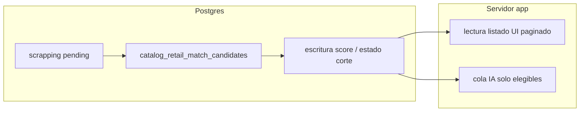

# Plan: scores de similitud en Postgres + alivio de interfaz

**Estado:** borrador para validación — no ejecutar migraciones ni cambios de RLS hasta aprobación explícita.

**Relación con otros documentos:** complementa [algoritmo-homologacion-scrapping-esquema-detalle.md](./algoritmo-homologacion-scrapping-esquema-detalle.md) (motor determinístico, IA solo hint, estándar Captura cadenas 2). Este plan se centra en **persistir puntuación y cortes en la base** para que la UI y los listados no dependan de recomputar el motor pesado en Node.

---

## 1. Problema que se quiere resolver

| Síntoma | Causa técnica actual (resumen) |
|---------|--------------------------------|
| La interfaz se siente **pesada** en paso 2 / resumen / bulk | Mucho trabajo en **servidor Node**: RPC `scrapping_similarity_prep_candidates_for_ids` devuelve JSON grande; luego `enrichRetailCandidatesCompositeScore`, `decideRetailMaster` / engine vnext, taxonomía Lider, etc., por fila o en lotes. |
| El “score” **no es un dato consultable** como fila estable | El `match_score` del RPC vive en el **JSON de respuesta** y en memoria; no hay columna ni tabla de puntuación oficial para `pending`. |
| Difícil argumentar “la base resuelve” | La definición efectiva está **partida** entre SQL (`catalog_retail_match_candidates`) y TypeScript (`retail-association`, `scrapping-similarity-*`, opcional engine vnext). |

**Objetivo de producto (acordado en conversación):**

1. Match contra catálogo **en base** (ya existe vía `catalog_retail_match_candidates`; aquí se formaliza **persistencia** y **cortes**).
2. **Persistir** puntuación (tabla dedicada y/o columnas en `scrapping`).
3. **Por debajo de umbral** → marcar **producto nuevo** (`pending_new`) **sin** pasar por IA.
4. **Solo por encima de umbral** → cola elegible para IA; si IA descarta → también **nuevo** (comportamiento a alinear con política actual de hints / no autovínculo).

---

## 2. Principios de diseño (innegociables del proyecto)

- **No dañar maestros** (`catalog_products`, vínculos); scrapping es cola.
- **IA no autovíncula** en el estándar: solo hint / evidencia (ya alineado con reglas del otro plan).
- **RLS:** cualquier `INSERT`/`UPDATE` masivo desde jobs debe usar **service_role** desde servidor ya gateado; no relajar políticas sin diagnóstico (ver `.cursor/rules/project-context.mdc`).
- **Paridad o documentación de divergencia:** si Postgres implementa un corte distinto al TS actual, hay que **medir** y **documentar** o **igualar** fórmulas.
- **Rendimiento listados:** la UI debe poder paginar/filtrar con índices sobre columnas numéricas o tabla hija indexada por `scrapping_id`.

---

## 3. Decisiones de arquitectura a validar

### 3.1 ¿Columnas en `scrapping` vs tabla hija?

| Opción | Ventaja | Inconveniente |
|--------|-----------|----------------|
| **A · Columnas en `public.scrapping`** (p. ej. `similarity_top_rpc_score`, `similarity_composite_top`, `similarity_scored_at`, `similarity_engine_version`) | Consultas simples para grillas; menos JOIN. | Tabla `scrapping` ya evoluciona mucho; mezcla “captura” con “resultado de scoring”. |
| **B · Tabla `scrapping_similarity_score` (1:1 o 1:N)** | Separación clara; historial de corridas si se define `run_id` o `computed_at` + version. | JOIN obligatorio en listados; índices explícitos. |
| **C · Híbrido** | Columnas **denormalizadas** para listado (top score, estado de corte) + tabla **auditoría** con detalle (top 5 ids, JSON reducido). | Más escritura; riesgo de desincronización si no se actualiza en misma transacción. |

**Recomendación para validar:** **B o C**. Si la UI solo necesita “top + umbral + fecha”, **B con una fila vigente** (`is_current` o `replaced_by` nulo) es clara. Si querés historial por cada pasada masiva, añadir `bulk_job_id` opcional.

### 3.2 ¿Qué score se persiste primero?

| Fase | Qué persistir | Quién calcula |
|------|----------------|---------------|
| **MVP-1** | `top_rpc_score` (máximo `match_score` entre candidatos RPC ya filtrados por activos + join catálogo, igual que hoy el prep) | Misma lógica SQL que `scrapping_similarity_prep_candidates_for_ids` (ideal: **una** función que escriba, no duplicar `LATERAL` en dos RPC distintas). |
| **MVP-2** | `second_rpc_score`, `gap_rpc` | Derivado del mismo conjunto expandido |
| **Fase 2** | `top_composite_score` (equivalente a `enrichRetailCandidatesCompositeScore` sobre el mejor candidato o top-k) | **O bien** port a SQL, **o bien** job TS que escribe resultado tras computar (menos “solo base”, más rápido de entregar). |

**Validación:** confirmar si el umbral de negocio para “ir a IA” y para “nuevo sin IA” debe basarse en **RPC solo**, en **compuesto**, o en **ambos** (doble reja).

### 3.3 ¿Cuándo se invalida el score?

- Al cambiar datos de la fila `scrapping` relevantes: `product_name`, `brand`, `price`, `sections`, `categories`.
- Al cambiar el catálogo que afecte candidatos (difícil de detectar en tiempo real): opciones — (i) TTL + recomputo en siguiente pasada; (ii) versión global `catalog_scoring_epoch` incrementada por migraciones de catálogo (pesado).
- **Mínimo viable:** invalidar cuando cambia la fila scrapping; recomputo explícito al iniciar pasada 2 o por botón “Recalcular scores”.

---

## 4. Flujo objetivo (después del plan)

1. **Job o RPC** (invocada con `service_role`) para conjunto de `id`: calcula candidatos, agrega scores, **escribe** filas en tabla de scores / columnas.
2. **UPDATE masivo** en la misma transacción o paso siguiente:
   - `WHERE top_rpc_score < umbral_rpc` → `catalog_match_status = 'pending_new'` (y opcionalmente `similarity_skip_reason = 'below_rpc_threshold'`).
   - Resto queda `pending` o estado intermedio `pending_scored` si se introduce.
3. **UI:** listados leen `scrapping` + join a scores; **sin** llamar al prep completo por cada página de grilla.
4. **IA:** solo ids que cumplan política (score + presupuesto + flags existentes).

---

## 5. Fases de implementación propuestas

### Fase 0 — Congelar contrato (1–2 días revisión, sin código)

- [ ] Decidir opción **3.1** (columnas vs tabla vs híbrido).
- [ ] Decidir umbral oficial: **solo RPC** vs **compuesto** vs ambos.
- [ ] Lista de estados `catalog_match_status` permitidos tras el corte (¿nuevo estado intermedio o solo `pending` / `pending_new`?).
- [ ] Confirmar que **no** se relaja “IA solo hint” ni autovínculo.

**Entregable:** checkmarks firmados en este documento o issue enlazado.

### Fase 1 — Esquema + RPC de escritura (DB)

- [ ] Migración: crear tabla o columnas + índices:
  - Índice compuesto típico: `(catalog_match_status, similarity_top_rpc_score DESC)` o en tabla hija `(scrapping_id)` PK + `(pending_filter, score)`.
- [ ] Función SQL única tipo `scrapping_similarity_refresh_scores_for_ids(uuid[])` que:
  - Reuse el mismo `LATERAL` que el prep actual (evitar duplicar lógica en dos funciones divergentes); idealmente **refactor** interno: CTE compartida → rama “json para compat” vs rama “upsert scores”.
  - Escriba scores y `computed_at`, `engine_version` (texto semver o hash de migración).
- [ ] Políticas: sin cambios agresivos a RLS; ejecución solo **service_role** desde código ya existente de admin.

**Validación técnica:**

- [ ] `EXPLAIN (ANALYZE)` sobre lote típico (80–220 ids).
- [ ] Comparar para muestra fija de 50 ids: `top_rpc_score` persistido vs máximo extraído hoy del JSON en TS (debe coincidir ±0).

### Fase 2 — Batch / bulk: escribir antes de decidir

- [ ] Al inicio de pasada masiva (o paso dedicado): llamar refresh de scores por chunks.
- [ ] Aplicar **UPDATE** “nuevo sin IA” por umbral RPC **antes** de entrar al bucle fino TS/IA (si negocio lo confirma).
- [ ] Mantener camino TS actual para filas **no** cortadas por umbral (paridad gradual) **o** desactivar por flag hasta validar.

**Flags sugeridos (env):**

- `SCRAPPING_SCORES_PERSIST_ENABLED=1`
- `SCRAPPING_AUTO_PENDING_NEW_BELOW_RPC=1` (peligroso hasta validar umbral)

### Fase 3 — UI y actions: lectura liviana

- [ ] Listados en Captura cadenas 2: `select` con columnas/join de scores; paginación server-side existente.
- [ ] Modal de revisión: cargar score desde DB; opción “recalcular” que invoque refresh para esa fila.
- [ ] Resumen previo: puede pasar a `COUNT(*)` agrupados por rangos en SQL (objetivo menor que 1 s según reglas de producto).

### Fase 4 (opcional) — Compuesto en Postgres

- [ ] Especificación matemática línea a línea copiada de `enrichRetailCandidatesCompositeScore` + entradas (título retail, precio, candidatos).
- [ ] Tests de paridad: dataset CSV/json con entrada/salida TS de referencia vs resultado SQL.
- [ ] Solo entonces sustituir escritura del compuesto TS por SQL.

---

## 6. Criterios de aceptación (validación funcional)

1. **Grilla paso 2** con 220+ filas: tiempo hasta primer paint de datos **perceptiblemente menor** que hoy (medición con timestamp en cliente + logs servidor).
2. **Reproducibilidad:** dos ejecuciones del refresh con mismos datos de entrada producen **mismos** scores almacenados.
3. **Corte umbral:** filas marcadas `pending_new` por RPC por debajo del umbral **no** consumen llamadas IA en la misma corrida (verificar con contador/log).
4. **Seguridad:** usuario sin permisos admin **no** puede invocar RPC de refresh masivo (mantener patrón actual de gate en actions).
5. **Rollback:** con flags en `0`, el sistema se comporta como **antes** de la fase 2 (sin UPDATE masivo automático).

---

## 7. Riesgos y mitigaciones

| Riesgo | Mitigación |
|--------|------------|
| **Drift** SQL vs TS al portar compuesto | Fase 1–2 solo RPC; compuesto en Fase 4 con tests de paridad. |
| **Doble trabajo** si coexisten prep JSON + refresh SQL | Unificar en una función SQL con dos salidas o tabla temporal interna. |
| **Marcar nuevo por error** masivo | Feature flag; dry-run mode que solo escribe scores sin `UPDATE` status; backup/undo por corrida con `bulk_job_id`. |
| **RLS / permisos** | Sin cambios amplios; RPC `SECURITY DEFINER` solo si revisión explícita de ownership y `search_path` fijo. |
| **Catálogo cambia** sin invalidar | Documentar TTL o botón de recomputo; no prometer “eterno” sin recomputo. |

---

## 8. Archivos del repo que tocarán (cuando se ejecute)

| Área | Archivos probables |
|------|-------------------|
| Migraciones | `supabase/migrations/*_scrapping_similarity_scores*.sql` |
| Bulk / prep | `src/server/retail/scrapping/scrapping-similarity-bulk-prep.ts`, posible nuevo `scrapping-similarity-scores-db.ts` |
| Resumen | `src/server/retail/scrapping/scrapping-similarity-bulk-summary.ts` |
| Actions | `src/app/actions/retail-scrapping.ts` |
| UI | `src/app/(app)/captura-cadenas-2/*.tsx` |
| Tipos Supabase | regenerar tipos cliente si aplica al flujo del proyecto |

---

## 9. Checklist de “listo para producción”

- [ ] Migración aplicada en staging; smoke test bulk 100 filas.
- [ ] Métricas: tiempo refresh, tiempo listado, errores RPC.
- [ ] Documento de umbral y versión de motor (`engine_version`) publicado para soporte.
- [ ] Plan de rollback y flags documentados en `.env.example` o wiki interna.

---

## 10. Próximo paso para el equipo

1. Revisar secciones **3** y **5** y marcar decisiones.
2. Si se aprueba **Fase 1**, crear issue/ticket con migración SQL y criterios de la sección **6**.
3. No mezclar con retiro de legado **Precios cadenas** salvo dependencia explícita de código compartido.

---

*Documento generado para validación de arquitectura; ajustar fechas y owners al crear el ticket de implementación.*
